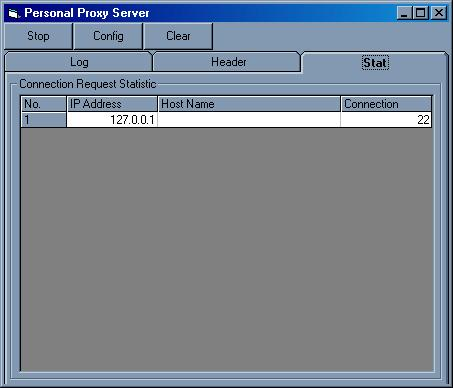



## An updated Personal Proxy Server \!\!

### Description

Thanks for all your interests in my original post, i've updated many bugs... so try it out yourself... have fun.

Purpose :

An http proxy server which relay request from client to the original server/other proxy.
 
### More Info
 
Use the break on unhandled error instead of break on all error for error trapping

             |
---                |---
**Submitted On**   |2001-04-24 12:50:36
**By**             |[Ian Surya](https://github.com/Planet-Source-Code/PSCIndex/blob/master/ByAuthor/ian-surya.md)
**Level**          |Intermediate
**User Rating**    |4.6 (96 globes from 21 users)
**Compatibility**  |VB 5\.0, VB 6\.0
**Category**       |[Complete Applications](https://github.com/Planet-Source-Code/PSCIndex/blob/master/ByCategory/complete-applications__1-27.md)
**World**          |[Visual Basic](https://github.com/Planet-Source-Code/PSCIndex/blob/master/ByWorld/visual-basic.md)
**Archive File**   |[An updated187614242001\.zip](https://github.com/Planet-Source-Code/ian-surya-an-updated-personal-proxy-server__1-22649/archive/master.zip)

